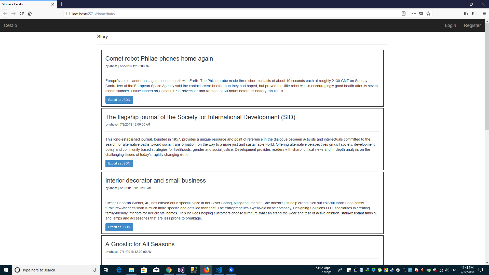

# Cefalo

##Setting Up
1. Necessary tools - Visual Studio 13,15 or 17 & SQL Server 2008 or above.
2. Download the project
3. Open the db.sql file using SQL Server. This will generate the Database tables and stored procedures.
4. Open Visual Studio and Open the project solution file. This will load the project.
5. Navigate to Web.config file. Search for connection string. On the Connection String change the Server Name according to your SQL Server name.
5. Now the project is ready to to be run. Build and run the project.
-----------------------
##Views
###Home

###Home Logged In

###User Login in

###User Register

###Create New Story

###Update Story

###JSON output

-----------------------
##Status
###Phase 1
1. Creating the page for creating a new story. [x]
2. Story is stored in the DB. [x]

###Phase 2
1. Display a list of stories. [x]
2. Display the list in descending order. [bug]
3. Adding pagination for stories. [not done]

###Phase 3
1. Edit functionality. [x]
2. Delete functionality ~~after confirmation~~. [x]

###Phase 4
1. Export the stories as JSON. [x]
2. Export the stories as XML. [bug]

###Phase 5
1. Authentication layer. [x]
2. Logged in User can create new story. [x]
3. Logged in User can edit or delete only his/her stories. [x]

#Project Details
* Author - Ahnaf Shahriar
* Client - Cefalo
* Description - Assignment for the position of intern @ Cefalo.
* Contact - bdahnaf@gmail.com
